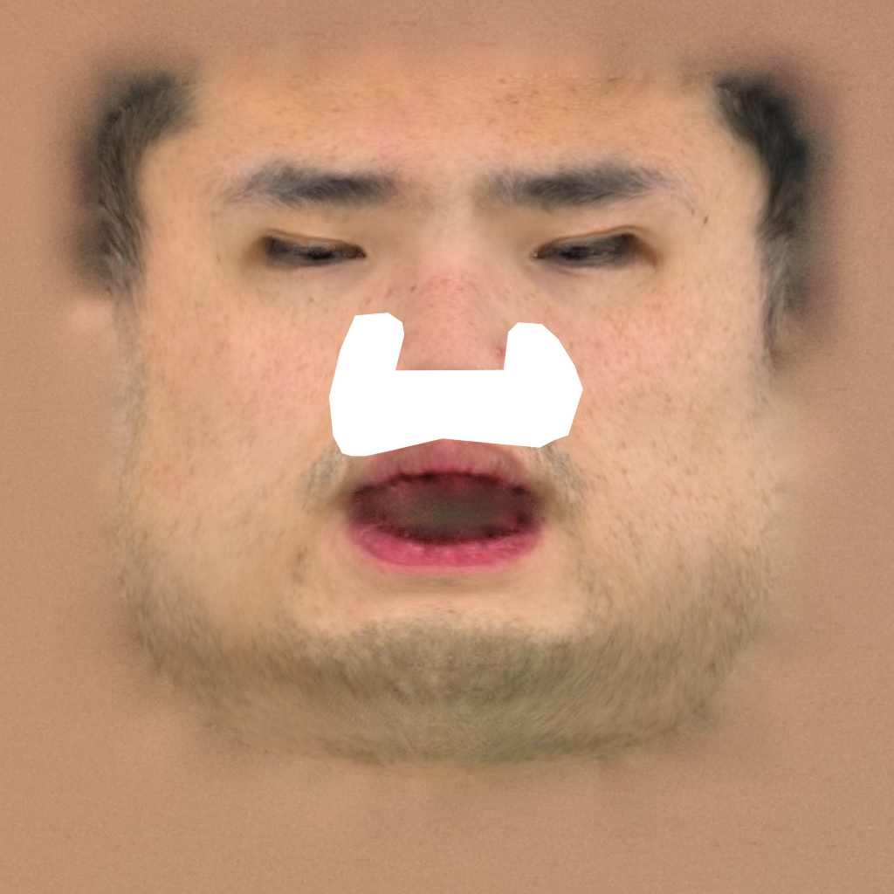

# Processing Custom Data

Below, I will use this [video](https://drive.google.com/file/d/1zwl7SW_aEsNBpEqpTHpCewi6RjE4NwOe/view?usp=sharing) as an example to introduce how to process a custom captured video into the WildCap data format.
First, you need to download the [example video](https://drive.google.com/file/d/1zwl7SW_aEsNBpEqpTHpCewi6RjE4NwOe/view?usp=sharing) into the `video` folder.

**1. Geometry Reconstruction**: 

We use [STFR](https://github.com/yxuhan/STFR) for facial geometry reconstruction.
First, you need to download it:
```
git clone https://github.com/yxuhan/STFR
```

Then, follow the instructions in [this document](https://github.com/yxuhan/STFR/blob/main/ENV.md) to setup the code environment for `STFR`, then run the following code for reconstruction:

```
cd STFR
CUDA_VISIBLE_DEVICES=0 python run.py \
    --video_path ../video/ljf.MOV \
    --video_step_size 10 \
    --video_ds_ratio 0.375 \
    --reg_close_eye 1 \
    --save_root ../workspace/ljf
cd ..
```

**2. Per-View Diffuse Albedo Prediction**:

Obtain your SwitchLight API KEY from [here](https://www.switchlight-api.beeble.ai/account).
Then, use SwitchLight to predict the diffuse albedo image for each view:

```
python switchlight_delight.py \
    --api YOUR_SWITCHLIGHT_API_KEY \
    --img_root workspace/ljf/sample_dataset/image \
    --save_root workspace/ljf/sample_dataset/image_switchlight
```

**3. Texture Reconstruction**:

Build a texture map using the reconstructed geometry and the predicted diffuse albedo images:

```
cd STFR/texture
python build_texture.py \
    --img_name image_switchlight \
    --data_root ../../workspace/ljf/sample_dataset \
    --device 0 
cd ../..
```

**4. Shadow Mask Creation**:

Manually draw a mask to locate the baking artifacts in the texture map and save it into `workspace/ljf/sample_dataset/shadow_mask.png`. 
You can directly mark a pure white area on the texture map, and our code `run_wildcap.py` will automatically recognize the pure white region to obtain a binary mask. 
The mask does not need to be drawn accurately; a coarse one is OK.
I recommend making the mask larger than the actual artifact area, as this usually yields better shadow removal results. 
Below is an example I created using the Polygonal Lasso Tool in Photoshop：



Note that in `run_wildcap.py`, this manually-created mask will be multiplied with `assets/shadow_prior_mask.png` to obtain the actual shadow mask.

**5. Reflectance Initialization**
Generate the refelctance map for initialization to resolve the ambiguity between lighting and albedo:
```
python create_init_map.py \
    --skin_tone "[0.6902, 0.5373, 0.4471]" \
    --save_root workspace/ljf/sample_dataset/init_map

You should change the RGB skin tone based on your captured subject.
```

After completing all the above steps, you will have obtained all the data required to run WildCap:
```
texture_path: workspace/ljf/sample_dataset/texture/image_switchlight/00150/uv.png
shadow_mask_path: workspace/ljf/sample_dataset/shadow_mask.png
init_map_root: workspace/ljf/sample_dataset/init_map
```

Now, you can return to Step 3 in the [README](README.md) to run the code for reflectance estimation.
