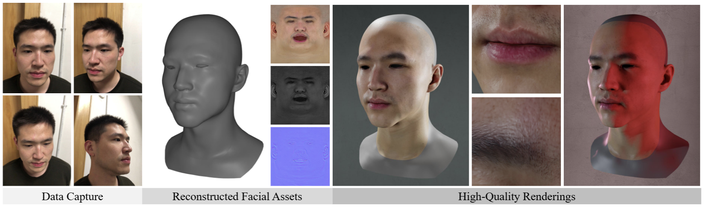

# WildCap: Facial Appearance Capture Made Easy



This is a PyTorch implementation of the following paper:

**WildCap: Facial Albedo Capture in the Wild via Hybrid Inverse Rendering**, CVPR 2026.

Yuxuan Han, Xin Ming, Tianxiao Li, Zhuofan Shen, Qixuan Zhang, Lan Xu, and Feng Xu

[Project Page](https://yxuhan.github.io/WildCap/index.html) | [Video](https://www.youtube.com/watch?v=EKkHsVTUMAg) | [Paper](https://arxiv.org/abs/2512.11237)

## Feature
Unlike my previous projects (i.e., [CoRA](https://github.com/yxuhan/CoRA) and [DoRA](https://github.com/yxuhan/DoRA)), achieving 4K-level high-quality facial appearance capture **no longer requires data capture in a darkroom.** 
***WildCap*** can reconstruct even higher-quality facial reflectance maps than [DoRA](https://github.com/yxuhan/DoRA) from **a smartphone video of human face captured in-the-wild!**

Technically, the biggest advantage of ***WildCap*** over previous works (e.g., [FLARE](https://github.com/sbharadwajj/flare), [NextFace](https://github.com/abdallahdib/NextFace), and [Xu et al.](https://arxiv.org/abs/2412.12765)) lies in its robustness to **hard shadows.**
Even when there are large hard shadows on the face — which are common in in-the-wild scenarios, as both indoor lights and the sun can cast such shadows — ***WildCap*** still produces clean reflectance maps, *a capability that previous methods cannot achieve*.

## Document
**Step 1:** Set up the code environment according to [ENV.md](ENV.md).

**Step 2:** Prepare the data. You can either run our [preprocessed dataset](https://drive.google.com/file/d/1H-RmFa5Rr66tRAmUY_riXcvgpwr-AS_P/view?usp=sharing) (download and put it into `data/wildcap_dataset`), or process videos captured by yourself into our data format following [PROCESS.md](PROCESS.md).

**Step 3:** Running the appearance capture code:
```
# this script will run all the subjects in our preprocessed dataset
sh run.sh  

# run an specific subject (all the hyper-parameters are shared across subjects)
python run_wildcap.py \
    --log_dir data/ljf/results/debug_env \
    --pho_scale 1.0 \
    --grad_scale 1.0 \
    --dps_steps 1000 \
    --uv_ds 4 \
    --vis_freq 100 \
    --env_light_path xxx \
    --eta 1.0 \
    --baseline 0 \
    --reg_scale 1.0 \
    --tv_scale 0.1 \
    --n_dpps 20 \
    --sr_scale 1 \
    --shadow_mask_path data/ljf/shadow_mask.png \
    --shade_init 1 \
    --sche_light 1 \
    --main_light_type splitsum \
    --opt_light_iter 300 \
    --light_res 96 \
    --init 1 \
    --init_add_noise_step 600 \
    --data_root data/ljf \
    --texture_path data/ljf/uv_switchlight.png \
    --init_map_root data/ljf/initmap \
    --model_dir models
```

**Step 4:** SR the reflectance maps to 4K resolution (TODO)

**Step 5:** Full-head texture and geometry completion (for visualization usage) (TODO)

## Improvements Over the Paper Version

Compared with the original paper, this open-source implementation includes the following key improvements:

**1. Better posterior sampling strategy**: We adopt [DPPS](https://github.com/74587887/DPPS_code) in this code release, which is an enhanced version of the [DPS](https://github.com/DPS2022/diffusion-posterior-sampling) technique mentioned in the paper.

**2. Better base lighting model**: We use [Split-Sum](https://github.com/NVlabs/nvdiffrec) to model the base lighting, and we find it performs better than SH lighting mentioned in the paper.

**3. Open-source compatible reflectance initialization strategy**: The reflectance initialization strategy proposed in the paper relies on the closed-source Light Stage scan dataset. To maintain the open-source nature of this project, we apply a new strategy: everyone uses the same initial specular and normal maps, while the initial diffuse map is a pure-color image. Compared with the paper version, this strategy avoids copyright issues and achieves almost the same performance as the paper’s method. See `create_init_map.py` and [PROCESS.md](PROCESS.md) for more details.

## Contact
If you have any questions or are interested in collaboration, please contact Yuxuan Han (hanyx22@mails.tsinghua.edu.cn).

## Citation
Please include the following citations if it helps your research:

    @inproceedings{han2026wildcap,
        author = {Han, Yuxuan and Ming, Xin and Li, Tianxiao and Shen, Zhuofan and Zhang, Qixuan and Xu, Lan and Xu, Feng},
        title = {WildCap: Facial Albedo Capture in the Wild via Hybrid Inverse Rendering},
        journal={CVPR},
        year={2026}
    }

